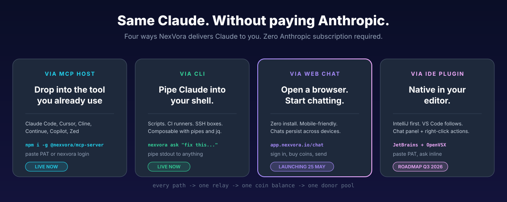
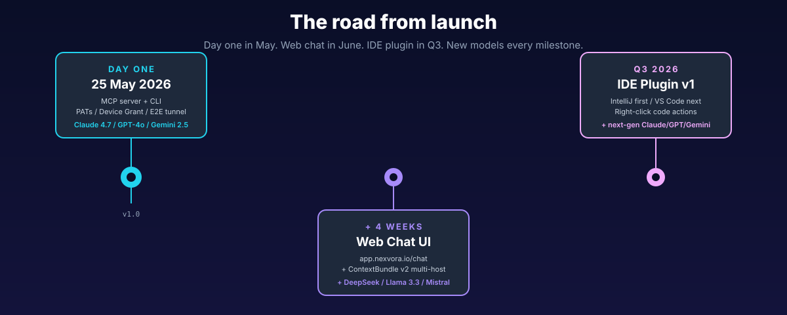

<div align="center">



&nbsp;

# **Use Claude. Skip the bill.**

### Donor-powered AI capacity. Pay coins per task, not subscriptions.

[](https://app.nexvora.io/waitlist)
[](https://app.nexvora.io/donors/apply)
[](https://nexvora.io)
[](https://nexvora.io)

</div>

---

## What this is, in one breath

> **You shouldn't have to pay $20 a month for Claude when half the people already paying don't use it.**

NexVora is a relay between people who pay for Claude / GPT / Gemini and people who want to use it without a subscription. **Donors lend their idle capacity. Requesters pay coins per task.** End-to-end encrypted — we never see your prompt, ever.

**Closed beta is open today. Public launch on 25 May 2026.**

---

## Four ways in

<div align="center">



</div>

<table>
<tr>
<th width="25%">⚡ MCP host</th>
<th width="25%">🖥️ CLI</th>
<th width="25%">🌐 Web chat</th>
<th width="25%">🧩 IDE plugin</th>
</tr>
<tr>
<td valign="top">

Drop into Claude Code, Cursor, Cline, Continue, Copilot, or Zed.

```bash
npm i -g @nexvora/mcp-server
nexvora login
```

<sub>**LIVE NOW**</sub>

</td>
<td valign="top">

Pipe Claude into shells, CI runners, SSH sessions.

```bash
npm i -g @nexvora/cli
nexvora ask "fix this"
```

<sub>**LIVE NOW**</sub>

</td>
<td valign="top">

Open a browser. Zero install. Mobile-friendly.

```
app.nexvora.io/chat
```

<sub>**+ 4 weeks after launch**</sub>

</td>
<td valign="top">

Native in your IDE. Right-click code → ask.

```
JetBrains Marketplace
+ OpenVSX
```

<sub>**Q3 2026**</sub>

</td>
</tr>
</table>

<div align="center">

**One coin balance. Every surface. Every model.**

</div>

---

## 💰 What it costs

A single Claude Sonnet 4.6 task costs **15 coins ≈ $0.075**. One coin is half a US cent. **40% cheaper than our pre-launch pricing.**

<table>
<tr>
<th>Model</th>
<th>Coins per task</th>
<th>≈ USD per task</th>
<th>Anthropic equivalent</th>
</tr>
<tr><td>Gemini 2.5 Flash</td><td><b>7</b></td><td>$0.035</td><td>(free tier)</td></tr>
<tr><td>Claude Sonnet 4.6</td><td><b>15</b></td><td>$0.075</td><td>$20/mo Pro</td></tr>
<tr><td>GPT-4o</td><td><b>18</b></td><td>$0.09</td><td>$20/mo Plus</td></tr>
<tr><td>Claude Opus 4.7</td><td><b>30</b></td><td>$0.15</td><td>$100/mo Max only</td></tr>
</table>

**Light Sonnet user** (20 tasks/mo): save **93%** vs Claude Pro.
**Moderate Opus user** (100 tasks/mo): save **85%** vs Claude Max.
**500 coins free on signup** — that's ~33 Sonnet tasks on the house.

---

## 🧠 Models we route to

<table>
<tr>
<th align="left">🟢 Live at launch</th>
<th align="left">🟡 + 4 weeks (June 2026)</th>
<th align="left">🟣 Q3 2026</th>
</tr>
<tr>
<td valign="top">

- Claude Sonnet 4.6
- Claude Opus 4.7
- Claude Haiku 4.5
- GPT-4o / 4o mini
- Gemini 2.5 Pro / Flash

</td>
<td valign="top">

- DeepSeek V3
- Llama 3.3 70B (donor Ollama)
- Qwen 2.5 72B (donor Ollama)
- Mistral Large 2
- Claude Haiku 5

</td>
<td valign="top">

- Next-gen Claude / GPT / Gemini as released
- Open-weight expansion
- Custom donor models (BYO weights)

</td>
</tr>
</table>

<sub>One coin balance, every model. Switch models per task with a single parameter.</sub>

---

## 🛣️ Roadmap

<div align="center">



</div>

We publish one quarter at a time. The roadmap is a calendar, not a wishlist.

---

## 🔐 The thing nobody else does

Every prompt is end-to-end encrypted between you and the donor. X25519 + HKDF-SHA256 + XSalsa20-Poly1305. We brokered the connection. We settled the coins. **We never saw your prompt.**

---

## ↓ Open repositories below

Look down for the pinned repos. Highlights:

- **`mcp-server`** — the npm package you install in your AI tool
- **`cli`** — the standalone command-line client
- **`daemon`** — the Rust daemon donors run to lend their capacity
- **`docs`** — architecture, integration guides, security model

We open-source the client-side surface. The relay backend stays closed-source while we harden it.

---

<div align="center">

### 🌍 Public launch — **25 May 2026**

<sub>Made by humans and donor-powered AI.<br/>
Free of Anthropic's bill. Free of OpenAI's bill.<br/>
Pay coins. Use anything.</sub>

[](mailto:hello@nxvora.online)
[](https://nexvora.io)

</div>
